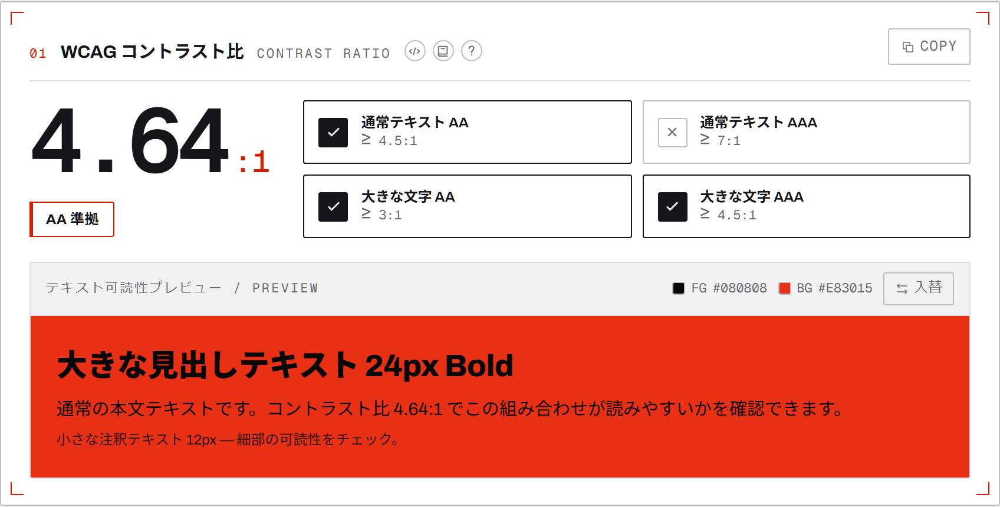

# Color Follows Function（CFF）

**感覚で扱われがちな「色」を、数値で判断できるようにする色彩定量解析ツール。**

🔗 **<https://color-follows-function.net>**

コントラスト比・色差 ΔE・色覚シミュレーションなどの指標で配色を「検証」し、
トーン展開・調和スキーム・アクセシブル化ナッジなどで配色を「設計」する、
ブラウザ完結（クライアント計算のみ・サーバーに色を送らない）の Web アプリです。

<picture>
  <source media="(prefers-color-scheme: dark)" srcset="./public/guide/card-dark.png">
  
</picture>

## 使い方

アプリ内に解説ページがあります → **[使い方（/guide）](https://color-follows-function.net/guide)**
（画面写真つき・操作手順・モード別のカード一覧・結果の持ち出し方）

要約すると3手です。

1. **色を入れる** — 画面下のパレットバーの ＋ から追加。共有リンク（`#p=…`）を開けばその配色が復元される
2. **単位と観点を選ぶ** — 単位（単色 / ペア / パレット）×観点（検証 / 設計）の組み合わせで表示カードが決まる
3. **結果を持ち出す** — デザイントークン（CSS 変数 / Tailwind / JSON）・共有リンク・AI に渡す Markdown

## 主な機能

指標カードは **全 43 枚**。[docs/04 カードカタログ](./docs/04_card_catalog.md) の全項目を実装済みです。

### 検証（Verify）

| 単位          | カード                                                                                                                                                                                                                                     |
| ------------- | ------------------------------------------------------------------------------------------------------------------------------------------------------------------------------------------------------------------------------------------ |
| 単色 (8)      | 色値サマリー（RGB/HEX/HSL/HSV・最寄り色名）/ HSV メーター / 相対輝度・対白黒コントラスト / 拡張色空間（OKLCH・OKLab・CIELAB・CIELCH・XYZ・xy・HWB・CMYK）/ 知覚明度・色温度 / 不透明度 / 色相環 / ガマット・出力適合                       |
| ペア (5)      | WCAG コントラスト比（AA/AAA 判定・可読性プレビュー）/ 色差 ΔE（CIEDE2000）/ 色覚シミュレーション（P/D/T型）/ APCA コントラスト（Lc）/ 色差の内訳（ΔE76/94/00・成分差）                                                                     |
| パレット (14) | パレット概要 / コントラスト比マトリクス / ΔE マトリクス / 色相分布・エントロピー / 明度・彩度分布 / 暖寒バランス / グレースケール耐性 / 色覚識別性 / 冗長性検出 / 役割カバレッジ / 調和スキーム判定 / UI モック・SVG・データビズプレビュー |

### 設計（Design・単位共通 16 枚）

ベース配色 / 調和スキーム生成 / トーン展開（50–900）/ 色相シフト /
明度・彩度バリエーション / 2色間グラデーション（sRGB・OKLab・HSV 補間）/
色のミックス / アクセシブル化ナッジ（AA/AAA 補正）/ 色覚セーフ提案 /
不足色の補完提案 / ダーク・ライト変換 / 並べ替え・正規化 /
セマンティックロール割当 / 色名検索 / 配色テンプレート /
デザイントークン出力（CSS 変数・Tailwind・JSON）

### 学びの導線（4ページ）

| ページ                 | 内容                                                                                                          |
| ---------------------- | ------------------------------------------------------------------------------------------------------------- |
| **使い方**（/guide）   | 操作手順・モード別のカード一覧（registry から生成）・結果の持ち出し方。画面写真は Playwright が実画面から撮る |
| **学習**（/learn）     | 指標別リファレンス・記事 14 件・ベンチツール・用語集                                                          |
| **図書館**（/library） | 蔵書 20 冊（読者＝エンジニア / デザイナーで絞り込み）・指標からの索引・書籍ごとの詳細（`/library/[id]`）      |
| **実装**（/code）      | 計算ライブラリ 12 件（culori・Color.js・apca-w3・CSS ネイティブ等）と、指標からの索引                         |

各カードの見出しには同じ3つの入口があります: **?**（指標の説明）/ **本**（参考資料と書籍）/ **⟨/⟩**（いま表示中の色を埋めた実装コード）。

### 横断機能

- **共有 URL** — パレットは URL ハッシュ（`#p=…`）に同期され、リンクを開くだけで再現
- **AI に渡す** — いまの診断結果（コントラスト比・APCA・ΔE・危険なペア）を Markdown でコピー。エディタの AI にそのまま貼れる
- **`/llms.txt`** — 指標の定義・目安・対応ライブラリ・参考資料を 1 枚のテキストで公開（`references.json` / `help.ts` / `glossary.json` から自動生成）
- **カラーコード** — 表示形式（HEX/RGB/HSL/HSV）をアプリ全体で切替、どこでもクリックコピー
- **テーマ / 言語** — ライト・ダーク、日本語・英語（設定メニューから切替、localStorage に保持）
- **アクセントカラー** — パレットの任意の色を UI の差し色に指定（a11y 自動補正つき）
- **PWA** — インストール可能・オフライン起動（アプリシェルと静的データをプリキャッシュ）

## 技術スタック

- **Next.js 16**（App Router・Turbopack）+ **React 19** + **TypeScript**（strict、`any`/`unknown` 不使用）
- **Tailwind CSS v4**（`@theme` デザイントークン）・react-aria-components・motion・iconoir-react
- **zustand**（状態）・**culori**（OKLCH/ガマットマッピング）・**zod**（静的データ検証）
- すべての色計算は `src/core/color` の純関数（CIEDE2000 は Sharma 標準データ、APCA は既知値で検証）

詳細は [docs/08 技術スタック](./docs/08_tech_stack.md) と [docs/07 計算仕様](./docs/07_card_calculation_specs.md) を参照。

## 開発

```bash
pnpm install
pnpm dev            # 開発サーバー（http://localhost:3000）

pnpm test           # ユニットテスト（vitest）
pnpm e2e            # E2E + axe アクセシビリティ検査（Playwright）
pnpm typecheck      # tsc --noEmit
pnpm lint           # ESLint
pnpm format         # Prettier
pnpm knip           # 未使用コード検出
pnpm links:check    # 参考資料・ライブラリのリンク生存確認（手動メンテ用）
pnpm guide:shots    # 使い方ページの画面写真を撮り直す（下記）
pnpm screenshots    # PWA マニフェスト用の画面写真を撮り直す
```

コミット時は husky + lint-staged が format → typecheck → test → knip を自動実行します。
コミット規約は [docs/13](./docs/13_commit_convention.md)（Conventional Commits・日本語）。

### E2E の実行

`pnpm e2e` は dev サーバー（ポート 3100）を自動起動します。
本番ビルドで検証したいとき、あるいは別の dev サーバーと並行して動かしたいときは:

```bash
pnpm build
PW_START=1 pnpm e2e
```

a11y 検査（`e2e/a11y.spec.ts`）は moderate 以上の違反を失敗として扱い、
全ページ・オーバーレイ表示中・書籍導線が出た状態まで対象にしています。

## ディレクトリ構成

```
src/
  app/            # App Router（/ ・/guide・/learn・/library・/code・/llms.txt・PWA マニフェスト）
  components/     # 共有 UI（ヘッダー・パレットバー・設定・ピッカー・カード枠等）
  core/color/     # 色計算の純関数層（変換・コントラスト・色差・CVD・分析・提案）
  features/
    cards/        # 指標カード（registry 駆動）・ヘルプ・スニペット・書籍導線
    guide/        # 使い方画面（手順・モード別カード一覧・画面写真）
    learn/        # 学習コンテンツ画面（記事・リファレンス・用語集）
    library/      # 図書館画面（蔵書一覧・書籍詳細）
    code/         # 実装画面（計算ライブラリ・指標からの索引）
  data/           # 構造化データ（references.json・glossary.json・guideShots.json）
  lib/            # i18n・テーマ・アセットローダー・AI レポート等
  store/          # zustand ストア（パレット・モード・ピッカー）
public/
  data/           # 静的アセット（色名辞書・調和ルール等）
  guide/          # 使い方ページの画面写真（ライト/ダーク・自動生成）
scripts/          # リンク確認・画面写真生成
docs/             # 設計ドキュメント（コンセプト〜実装計画）
e2e/              # Playwright テスト（フロー・a11y・レイアウト・i18n・オフライン）
```

設計ドキュメントの入口は [docs/README.md](./docs/README.md)。

## 使い方ページの画面写真

`/guide` の画面写真は手で撮らず、E2E と同じ Playwright で実画面から撮ります
（UI を変えたら撮り直しを忘れる、を仕組みで防ぐため）。

```bash
pnpm build && pnpm start &               # もしくは pnpm dev
pnpm guide:shots                         # 既定は http://localhost:3000
pnpm guide:shots http://localhost:3100   # URL は引数で上書きできる
```

- 出力: `public/guide/<id>-light.png` / `<id>-dark.png`（テーマごとに2枚、ページ側が CSS で出し分け）
- 併せて `src/data/guideShots.json`（CSS ピクセルの寸法）を更新し、`img` の width/height に使ってレイアウトシフトを防ぐ
- 「どの操作の結果を撮るか」は `scripts/generate-guide-shots.mjs` の `SHOTS` に定義。撮りたい画面が増えたらここに足す

## 公開 URL と環境変数

canonical・OG 画像・`sitemap.xml`・`llms.txt` は絶対 URL を必要とします。
解決順は `NEXT_PUBLIC_SITE_URL` → Vercel のプレビュー URL → 本番ドメイン
（`https://color-follows-function.net`）→ `localhost`（`src/lib/site.ts`）。
本番・プレビューでは通常設定不要です。

## 書籍リンクのアフィリエイト設定

書籍リンクは Amazon アソシエイトの短縮リンク（`https://amzn.to/...`）です。
アソシエイト ID は短縮リンク自体に内包されるため、アプリ側の設定項目はありません。

書籍が出る場所は 4 か所。購入リンク（アフィリエイト）を置く 3 か所には PR 表記を添え、
カード末尾の導線は内部リンク 1 本に留めています。

| 場所                          | 内容                                                 | 購入リンク |
| ----------------------------- | ---------------------------------------------------- | ---------- |
| 図書館（`/library`）          | 蔵書一覧（読者で絞り込み）と、指標から書籍を引く索引 | あり（PR） |
| 書籍の詳細（`/library/[id]`） | 本文・扱う指標・購入導線                             | あり（PR） |
| カードの本マーク（参考資料）  | その指標を扱う書籍を最大 2 冊                        | あり（PR） |
| カード末尾の書籍導線          | 結果に連動して 1 画面 1 件・1 行だけ                 | なし       |

書籍の追加・差し替えは `src/data/references.json` の `books` を編集します:

```jsonc
{
  "id": "安定した識別子", // React キー・URL・テスト用。版が変わっても据え置く
  "title": "書名",
  "author": "著者名",
  "publisher": "出版社",
  "year": 2017, // 邦訳版・改訂版はその版の発行年
  "shelf": "accessibility", // theory / practice / accessibility / psychology / reference / engineering
  "audience": "engineer", // engineer / designer / both（図書館の「読者で絞る」に効く）
  "accent": "#1F63AA", // カバータイルの地色（書影は規約上使えないため色で識別する）
  "topics": ["contrast", "cvd"], // 扱う指標（カードの helpKey）。索引と本マークに効く
  "pitch": { "ja": "一言レコメンド", "en": "..." }, // 一覧に出る 1 行
  "summary": { "ja": ["段落", "段落"], "en": ["...", "..."] }, // 詳細ページの本文
  "links": {
    "print": "https://amzn.to/...", // 単行本（必須）
    "kindle": "https://amzn.to/...", // Kindle（電子版がなければ省略）
  },
}
```

`topics` に書いた helpKey は実在する指標である必要があり、
`pnpm test`（`src/lib/references.test.ts`）が検証します。
`links` に両方の版があると「単行本」「Kindle」の 2 チップが並びます。

結果連動の導線は 2 ファイルに分かれます:

- `src/features/cards/nudgeSlot.ts` … どの指標がどの書籍へ送るか（`NUDGE`）
- `src/features/cards/nudge.ts` … 各指標の成立条件と、1 画面 1 件の選抜

出す 1 件は「そのモードで描かれるカードのうち、条件を満たす LAYOUT 順の先頭」。
カード側は `<BookNudge helpKey="..." />` を置くだけで、条件判定は持ちません。

## 計算ライブラリとスニペットの追加

`/code` に並ぶ計算ライブラリは `src/data/references.json` の `libraries` を編集します:

```jsonc
{
  "id": "culori", // 安定した識別子（/code のアンカー・スニペットの参照先）
  "name": "culori",
  "pkg": "culori", // npm パッケージ名。CSS ネイティブなど入れるものが無ければ省略
  "kind": "js", // js / css
  "url": "https://culorijs.org/", // ドキュメント（一次情報）
  "repo": "https://github.com/Evercoder/culori", // 省略可
  "api": "converter() / wcagContrast()", // 代表 API（言語別に持たない）
  "topics": ["contrast", "deltae"], // 効く指標（カードの helpKey）
  "pitch": { "ja": "一言", "en": "..." },
}
```

カード見出しの `⟨/⟩` が出すスニペットは `src/features/cards/snippets.ts` に
`helpKey → (ctx) => コード` で定義します。`ctx` には画面の色（基準色・FG/BG・
パレット全色）が入るので、貼れば動く形にできます。期待値のコメントは
`core/color` の計算結果から生成します（表示と食い違わせない）。

記事・指標別リファレンスは同じ JSON の `articles` / `topics` に足すだけです。
追加したら `pnpm links:check` でリンクの生存を確認してください。
